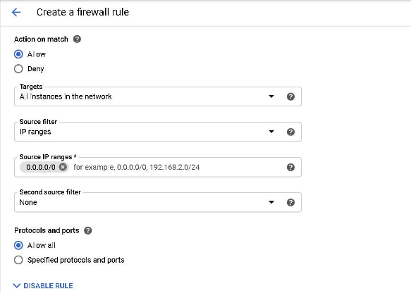
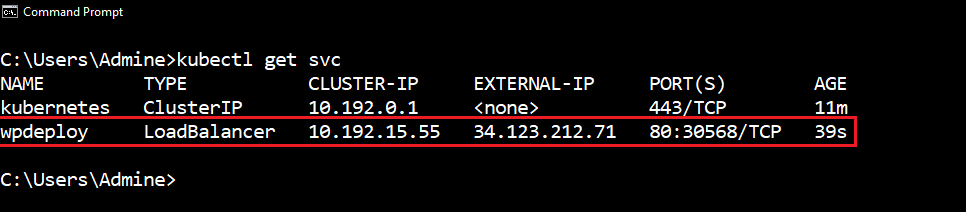
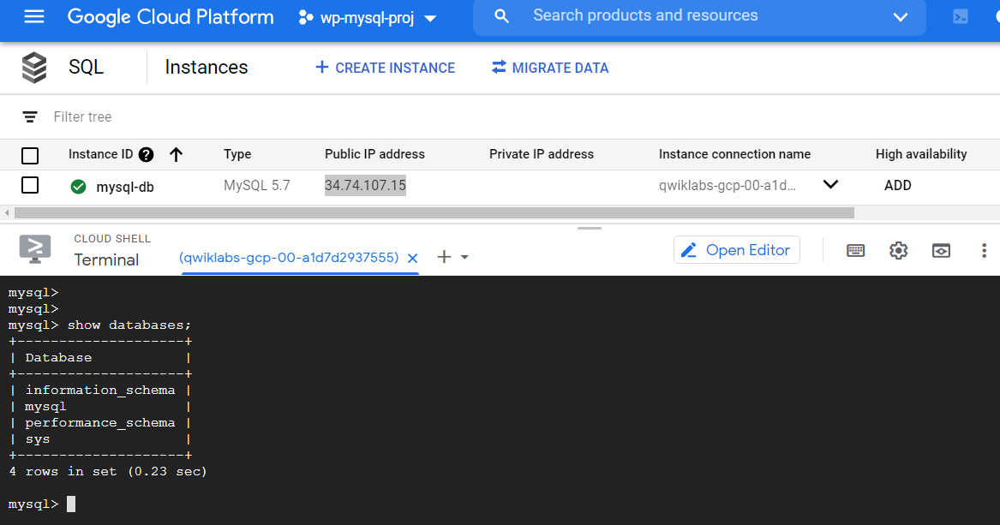
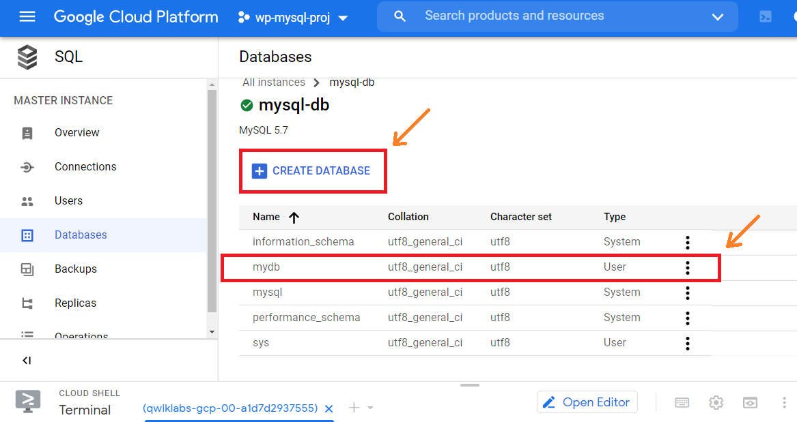

# GCP workshop: Wordpress-MySQL Project

Welcome folks to my Project! This project is based on GCP (Google Cloud Platform) & it involves various technologies & concepts like Networking, VPC, Kubernetes, Loadbalancers, Frontend application (WordPress), Database (MySQL) & some more internals which I discussed below.

## 🔰 Project Description:
- Create a project in the GCP account
- Create two VPC networks in the project, & one subnet inside each
- Create a link between both the VPC networks using **VPC Peering**
- Create a Kubernetes Cluster in one of the VPC network and launch any web application (like WordPress) with the Load balancer
- Create a SQL server in the other VPC network and create a database within
- Connect the SQL database to the web application (WordPress) launched in the Kubernetes cluster
- Finally should be able to access our WepApp

I've completed this Project using Google Qwiklabs, instead of GCP account due to unavailability of credit card. 😅\
But the practical can be done in exactly same way using normal GCP account.

Before that let's learn what is GCP & Kubernetes:

## What is GCP?
Google Cloud Platform, offered by Google, is a suite of cloud computing services that runs on the same infrastructure that Google uses internally for its end-user products, such as Google Search, Gmail, file storage, and YouTube. The platform includes a range of hosted services for compute, storage and application development that run on Google hardware. Google Cloud Platform services can be accessed by software developers, cloud administrators and other enterprise IT professionals over the public internet or through a dedicated network connection.

Google Cloud Platform offers services for compute, storage, networking, big data, machine learning and the internet of things (IoT), as well as cloud management, security and developer tools.

## What is Kubernetes?
Kubernetes, also known as K8s, is an open-source system for automating deployment, scaling, and management of containerized applications.

Kubernetes is a portable, extensible, open-source platform for managing containerized workloads and services, that facilitates both declarative configuration and automation. Kubernetes was originally designed by Google in the year 2014. It has a large, rapidly growing ecosystem. Kubernetes services, support, and tools are widely available. It is a Container Orchestration tool, which helps launch application over Containers which gives more power and flexibility & helps us manage them very easily.

## Project Completion:
I've completed the project & explained in detail below with screenshots attached for your reference. This project is based on real used case example. So, let's start building the architecture.

- For creating such an infrastructure on GCP, we first need to create a Project & attach it with the billing account.

- Now in this project let's create two VPC (Virtual Private Cloud) one for WordPress deployment and second for MySQL Database Instance. I have created the VPCs in two different regions named as "vpc1" in "us-central1" for Wordpress and "vpc2" in "us-east1" for MySQL Database. 
- We need to create one subnet each in both the VPCs for networking actions. Along side create firewall rule in the vpc1 for allowing all the ingress traffics.

- Both the VPCs are created:

- For connecting both the VPC's we have to use **VPC Peering** service in GCP. For peering the VPC'S we have to create VPC peer for both VPC1 and VPC2 as peer1 and peer2.

- Both the VPCs connected using VPC peering:

- Now we have to build a **Kubernetes master slave cluster** for deployment of WordPress application. Managing Kubernetes cluster can be a tedious work, but here we just need to use Google Kubernetes Engine (GKE) service provided by GCP & everything will be managed by them.
- To use Google Kubernetes Engine service we just have to tell the specifications in terms of Node Pool to them .Then they take all the responsibility further to create kubernetes cluster and about cluster management.
- Let's create the Kubernetes cluster in the vpc1 (for Wordpress) using GKE i.e., K8S as a service:

- Finally Kubernetes cluster created successfully:

- We need to access our K8S cluster for deploying out WordPress application. As to communicate with kubernetes master which send further task to its slave nodes we require **kubectl program*** to be configured in our system. In addition to this we require **Google Cloud SDK Shell** program also installed in our system. This is because we are using Google Cloud Platform which provides us Kubernetes As A Service through Google Kubernetes Engine (GKE).
- Google Cloud SDK Shell program provides us GCP related command to access our GCP account whereas Kubectl program provides us K8S related commands to operate our cluster.
- After installing Google Cloud SDK, we can login into our GCP account using the command: *"# gcloud auth login"* or *"# gcloud init"* to configure our CLI & choose the project as well.

- Now using the cmd: *"# gcloud projects list"* we can list all the projects in our GCP account:

- To communicate with our K8S cluster running on GCP we have to update the kubeconfig file so that kubectl command gets configured to contact to Google Kubernetes Engine.
- For this we need to run this below cmd, we can also find this cmd in the GCP WebUI by going into our K8S cluster in GKE service. 

- So, we have copied the cmd, now running this cmd in our system were we configured the gcloud program earlier

- Now as our system is connected to our K8S cluster on GCP, we check details of the nodes running in our cluster using cmd: *"# kubectl get nodes"*

- To deploy the WordPress application using kubernetes we have to create deployment in K8S using WordPress image for launching the pods.

- After creating the kubernetes deployment we have to launch the WordPress application on internet as by default in kubernetes environment is isolated .For these we have to expose the deployment on port no. 80 to access the application. Here we also require one **Load balancer** for the deployment which balances all the traffic load coming from public world on the application 
- **Load Balancer:** As we are using GKE which by default uses Load Balancer from GCP. But for kubernetes it is an external load balancer since we have to provide the load balancer to kubernetes deployment. For this using this cmd: *"# kubectl expose deployment <deployment_name> --type=LoadBalancer --port=80"*

- In kubernetes the load balancer is a Service. We can see all the services used by the deployment using cmd: *"# kubectl get services"*

- We can see even using GCP WebUI that a new LoadBalancer is created

- In K8S we can use cmd *"# kubectl get all"* to list details of all the resources including pods, services, deployment, replicasets, etc.

- Now as our Frontend application (WordPress) is properly deployed, so let's create the backend for storing the user data of WordPress application. For our backend we will use MySQL database. For us the critical thing is to manage the database for that we use Database As A Service by named as SQL.
- So let's launch the MySQL Database instance using SQL service of GCP in vpc2.

- Now login to the MySQL instance to see available databases using cmd: *"# mysql -h <public_ip> -u <user_name> -p"*. For this I used gcloud shell, which is an instance were the gcloud program is pre-installed.

- I created a new Database named "mydb" in the MySQL instance using GCP WebUI by just clicking on Create Database.

- Finally let's connect our WordPress application to the backend i.e with MySQL Database. Using the *public ip of load balancer* we can connect to WordPress application.

- Now it will ask for database login, password of the database user & Database Host i.e., the public IP of the MySQL instance.

- Finally it will ask to create a username-password to login into the Wordpress app. Create it & login into the application.

- So, we have successfully launched the whole infrastructure, let's check by creating & launching a webapp or blog through wordpress.

Finally, we successfully completed this Project based on Google Cloud Platform & also covering other concepts & technologies. This all was possible because of Sir Vimal Daga, who held this 2 days (8hrs) workshop on GCP, were I learned a lot & finaly was able to build this project.

Thanks for reading & keep learning! I'll meet you in the next one. 🙂
